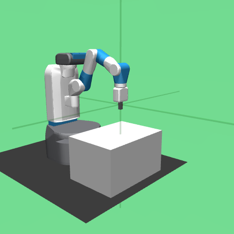
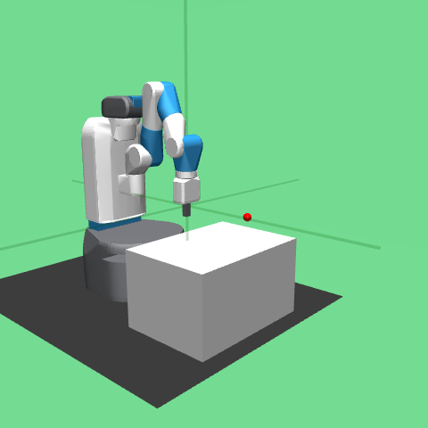

# Physical AI VLM Mini-Project (FetchReach) — Project Report

## 0. Executive summary
이 프로젝트는 Physical AI 파이프라인에서 **데이터 정제/평가 레이어**를 자동화하기 위해,
VLM을 “정책(policy)”이 아니라 **태깅기(tagger) + 판정기(judge)**로 연결한 end‑to‑end 미니 프로젝트입니다.

핵심 결과는 다음과 같습니다.
- VLM 호출 결과 1200건을 **구조화 출력(JSON Schema)로 수집**했고 스키마 검증 **errors=0**을 달성했습니다.
- progress 추정과 p_success 분류를 지표화해 **평가 루프**를 만들었고, ROI 적용 전/후를 ablation으로 비교했습니다.

## 1. Problem statement
Physical AI에서 반복(iteration)이 느려지는 대표 병목은 다음입니다.
- 로그/프레임이 쌓여도 “무슨 일이 일어났는지” 정리(태깅)와 평가가 어렵다.
- reward/성공 판정기가 없거나 비용이 커서, 학습/검증 루프가 느리다.

따라서 이 프로젝트는 **프레임 → (stage/failure_type) + (progress/p_success)**를 생성하고,
그 출력이 그대로 지표/리포트로 이어지는 “증거 체인”을 목표로 합니다.

## 2. System overview (A→Z)
1) **Data collection**: FetchReach-v4 에피소드 수집 + 프레임 저장  
2) **GT labeling**: dist 기반 progress_gt, is_success_episode_so_far 구성  
3) **Keyframe sampling**: 에피소드당 균등 샘플링으로 10개 키프레임 선정  
4) **VLM requests**: tagging/judge 요청 JSONL 생성 (tagging은 3‑frame mini‑clip을 함께 전달)  
5) **VLM inference**: Responses API + Structured Outputs(JSON Schema) + retry  
6) **Validation**: 출력 스키마 검증(누락/enum 이탈 방지)  
7) **Evaluation**: progress MAE/RMSE, p_success AUC/PR, confusion grid  
8) **Reporting**: taxonomy/그리드/불확실성 샘플/요약 리포트 생성  
9) **Ablation**: ROI crop 전/후 성능 비교(roi_ablation.md)

## 디렉토리 구조 (핵심)

```
xyz/
├── physai_vlm/
│   ├── __init__.py
│   └── taxonomy.py                # Reach taxonomy + schemas
├── collect_fetch_dataset_v2.py     # FetchReach 데이터 수집
├── build_vlm_inputs.py             # keyframes/labels/requests 생성
├── run_vlm_requests.py             # VLM 실행 (structured outputs + retry)
├── evaluate_judge.py               # progress MAE/RMSE
├── evaluate_success_auc.py         # p_success AUC
├── evaluate_success_pr.py          # PR table
├── report_taxonomy.py              # failure taxonomy 리포트
├── report_confusion_grid.py        # TP/FP/TN/FN 리포트
├── extract_uncertain_samples.py    # 불확실성 상위 샘플
├── roi_center_crop.py              # ROI 프레임 생성
├── compare_roi_effect.py           # ROI ablation 리포트
├── dataset_v2/
│   ├── episodes.jsonl
│   ├── frames/                      # 원본 프레임 (git 제외)
│   ├── frames_roi/                  # ROI 프레임 (git 제외)
│   ├── vlm/                          # (기존 실험 산출물)
│   └── vlm_v2/                        # (현재 리포트의 정본)
│       ├── keyframes.jsonl
│       ├── labels_gt.jsonl
│       ├── vlm_requests.jsonl
│       ├── vlm_outputs.jsonl
│       └── vlm_outputs_roi.jsonl
└── results/
    ├── summary.md
    ├── summary_with_images.md
    ├── confusion_grid_report.md
    ├── failure_taxonomy_report.md
    ├── roi_ablation.md
    └── uncertain_samples.jsonl
```

## 3. Evidence chain (재현 가능 결과)
- **입력**: `dataset_v2/vlm_v2/vlm_requests.jsonl` (tagging/judge, 총 1200 요청)
- **출력**: `dataset_v2/vlm_v2/vlm_outputs.jsonl` (1200 lines; tagging 600 / judge 600)
- **검증**: `OUTPUTS_PATH=... python validate_vlm_outputs.py` → errors=0
- **평가/리포트**: `evaluate_*.py`, `report_*.py`, `results/*.md`

## 4. Dataset & labeling
- **Env**: FetchReach-v4
- **Episodes**: 60 (성공 에피소드 6 포함)
- **Frames**: 1500 (fps_sample=2)
- **GT**
  - `is_success_episode_so_far`: info의 `is_success` 기반
  - `progress_gt`: dist(achieved_goal, desired_goal) 기반으로 [0,1] 스케일링
  - `stage_gt`: dist 기반 간단 휴리스틱(설명 가능/가볍게)

## 5. VLM I/O contract (Structured Outputs)
스키마/enum은 `physai_vlm/taxonomy.py` 단일 정의를 사용합니다.

- **tagging output**: stage/failure_type/confidence/notes  
- **judge output**: p_success/progress/uncertainty/judge_notes  

## 6. Metrics (정량 평가)
- **progress**: MAE, RMSE (600 프레임)
- **success**: ROC AUC, PR table (600 프레임, pos=51/neg=549)
- **error analysis**
  - confusion grid: TP/FP/TN/FN 예시 프레임
  - uncertainty top‑N: human audit 대상으로 추출

## 7. Results
- **Structured outputs 안정성**: 1200 outputs, validation errors=0
- **progress**: MAE/RMSE = **0.3811 / 0.4550**
- **p_success**: AUC = **0.5309**
- **tagging 분포(관측)**:
  - stage: approach 466 / reach 89 / align 45
  - failure_type: slow_progress 478 / unknown 122

### ROI ablation
ROI(중앙 crop, ratio=0.6) 전/후 비교 결과는 `results/roi_ablation.md` 참고.

## 8. Example images (TP/FP/TN)




## 9. Limitations & next steps
- **tagging 품질**: v2에서 `unknown` 비율이 감소했지만(600→122), failure_type이 `slow_progress`로 쏠리는 경향이 있음.  
  - 개선: progress_gt/시점 정보를 더 강하게 주거나(현재 이미 `t/T`를 제공), clip 길이 증가(예: 5프레임), 또는 failure_type을 “운영 목적”에 맞게 재정의
- **p_success 성능**: 프레임 단위 라벨이 “episode 성공”과 직접 대응하지 않아 noisy할 수 있음.  
  - 개선: episode-level success 예측/칼리브레이션, 임계값별 운영 정책(예: stop/slowdown)
- **현장 확장**: 다음 단계에서는 실제 로그(다중 카메라/상태/지연)까지 결합한 triage 도구로 확장

## 예시 이미지 (TP/FP/TN)


## 설치 및 실행

### 환경 설정
```bash
conda create -n physai_vlm python=3.10 -y
conda activate physai_vlm
pip install -r requirements.txt
```

### 1) 데이터 수집
```bash
python collect_fetch_dataset_v2.py
```

### 2) 입력 생성
```bash
OUT_DIR="dataset_v2/vlm_v2" python build_vlm_inputs.py
```

### 3) VLM 실행 (structured outputs)
```bash
export OPENAI_API_KEY="your-key"
export VLM_MODEL="gpt-4o-mini"
export INPUT_JSONL="dataset_v2/vlm_v2/vlm_requests.jsonl"
export OUTPUT_JSONL="dataset_v2/vlm_v2/vlm_outputs.jsonl"
python run_vlm_requests.py
OUTPUTS_PATH="dataset_v2/vlm_v2/vlm_outputs.jsonl" python validate_vlm_outputs.py
```

### 4) 평가/리포트
```bash
OUTPUTS_PATH="dataset_v2/vlm_v2/vlm_outputs.jsonl" python evaluate_judge.py
OUTPUTS_PATH="dataset_v2/vlm_v2/vlm_outputs.jsonl" python evaluate_success_auc.py
OUTPUTS_PATH="dataset_v2/vlm_v2/vlm_outputs.jsonl" python evaluate_success_pr.py
OUTPUTS_PATH="dataset_v2/vlm_v2/vlm_outputs.jsonl" OUT_MD="results/failure_taxonomy_report.md" python report_taxonomy.py
OUTPUTS_PATH="dataset_v2/vlm_v2/vlm_outputs.jsonl" LABELS_PATH="dataset_v2/vlm_v2/labels_gt.jsonl" OUT_MD="results/confusion_grid_report.md" python report_confusion_grid.py
OUTPUTS_PATH="dataset_v2/vlm_v2/vlm_outputs.jsonl" OUT_PATH="results/uncertain_samples.jsonl" python extract_uncertain_samples.py
OUTPUTS_PATH="dataset_v2/vlm_v2/vlm_outputs.jsonl" DATASET_PATH="dataset_v2/episodes.jsonl" OUT_MD="results/summary.md" python summarize_results.py
OUTPUTS_PATH="dataset_v2/vlm_v2/vlm_outputs.jsonl" OUT_MD="results/summary_with_images.md" python summarize_results_with_images.py
```

## Reach Taxonomy

| Type | 설명 |
|------|------|
| goal_mismatch | 목표 방향/목표 위치 불일치 |
| slow_progress | 진행이 정체됨 |
| oscillation | 진동/불안정 |
| occlusion | 시야 가림 |
| unknown | 미분류 |

Stage enum: `approach | reach | align | idle | unknown`

## 제출용 파일 (리포트)
- `results/summary_with_images.md`
- `results/confusion_grid_report.md`
- `results/roi_ablation.md`
